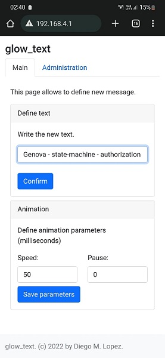

# About

Glow Text is an Arduino app to run in ESP32. It writes a text or symbols in a 4 displays 8x8 array.

It was developed using PaltformIO with Visual Studio Code.

In [this document](./doc/README.md) you'll find the electronic details to assemble this project.

# Getting started

To allow user to write new text, or change animation speed, glow_text creates a WiFi access point called `glow_text`. You can connect to this WiFi network and access the next [link](http://192.168.4.1) to change parameters.

# License

glow_text is an open source project by Diego M. Lopez that is licensed under [MIT](https://opensource.org/licenses/MIT). Diego M. Lopez reserves the right to change the license of future releases.

# Author

- Main idea, development and functional prototype by Diego M. Lopez (ldiegom@gmail.com)
