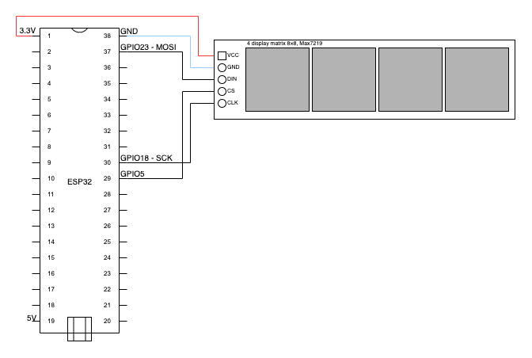

# Glow Text project details

This document describes the electronic construction of this project.

## Electronic componets

- 1x Esspresif ESP32.
- 1x 4 display matrix 8×8, Max7219.

## Electric diagram

## Prototype

For testing and viability purposes I built a full prototype that runs the glow_text and offers a good user experience. The prototype follows exactly the connections of the Electric diagram.
